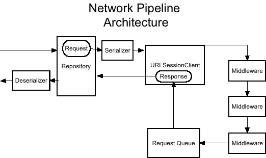

# Conduit

[](https://github.com/mindbody/Conduit/releases)
[](https://travis-ci.com/mindbody/Conduit)
[](https://github.com/Carthage/Carthage)
[](https://cocoapods.org/pods/Conduit)
[](http://cocoadocs.org/docsets/Conduit)

Conduit is a session-based Swift HTTP networking and auth library.

Within each session, requests are sent through a serial [pipeline](https://en.wikipedia.org/wiki/Pipeline_(software)) before being dispatched to the network queue. Within the pipeline, requests are processed through a collection of [middleware](https://en.wikipedia.org/wiki/Interceptor_pattern) that can decorate requests, pause the session pipeline, and empty the outgoing queue. From this pattern, Conduit bundles pre-defined middleware for [OAuth2](https://oauth.net/2/) authorization grants through all major flows defined within [RFC 6749](https://tools.ietf.org/html/rfc6749) and automatically applies tokens to requests as defined in [RFC 6750](http://tools.ietf.org/html/rfc6750).

- [Features](#features)
- [Requirements](#requirements)
- [Installation](#installation)
- [Core Networking](#core-networking)
	- [URLSessionClient](#urlsessionclient)
	- [HTTP Requests / Responses](#http-requests--responses)
	- [Middleware](#middleware)
	- [SSL Pinning](#ssl-pinning)
- [Auth](#auth)
	- [Configuration](#configuration)
	- [Token Storage](#token-storage)
	- [Token Grants](#token-grants)
	- [Auth Middleware](#auth-middleware)
- [Examples](#examples)
- [Credits](#credits)
- [License](#license)

## Features

- [x] Session-based network clients
- [x] Configurable middleware for outbound requests
- [x] Powerful HTTP request construction and serialization
- [x] JSON, XML, SOAP, URL-encoded, and Multipart Form serialization and response deserialization
- [x] Complex query parameter serialization
- [x] Cancellable/pausable session tasks with upload/download progress closures
- [x] SSL pinning / server trust policies
- [x] Network Reachability
- [x] OAuth2 client management
- [x] Automatic token refreshes, client_credential grants, and token storage
- [x] Full manual control over all token grants within RFC 6749
- [x] Automatic bearer/basic token application
- [x] Embedded authorization page / authorization code grant strategies
- [x] Support for multiple network sessions / OAuth2 clients
- [x] Interfaces for migrating from pre-existing networking layers

## Requirements
- iOS 8.0+ / macOS 10.10+ / tvOS 9.0+ / watchOS 2.0+
- Xcode 8.1+

| Conduit  Version | Swift Version |
|------------------|---------------|
| 0.4.x            | 3.x           |
| 0.5 - 0.7.x      | 4.0           |
| 0.8.x+           | 4.1           |

## Installation

### Carthage

Add `Conduit` to your `Cartfile`:

```
github "mindbody/Conduit"
```

### Cocoapods

Add `Conduit` to your `Podfile`:

```
source 'https://github.com/CocoaPods/Specs.git'
platform :ios, '9.0'
use_frameworks!

target 'MyApplicationTarget' do
    pod 'Conduit'
end
```

### Swift Package Manager

Add `Conduit` to your `Package.swift`:

```swift
// swift-tools-version:4.1
import PackageDescription

let package = Package(
    dependencies: [
        .package(url: "https://github.com/mindbody/Conduit.git", from: "0.10.0")
    ]
)
```
---

## Core Networking

### URLSessionClient

The heart and soul of Conduit is `URLSessionClient`. Each client is backed by a `URLSession`; therefore, `URLSessionClient`'s are initialized with an optional `URLSessionConfiguration` and a delegate queue.

```swift
// Creates a new URLSessionClient with no persistent cache storage and that fires events on a background queue
let mySessionClient = URLSessionClient(sessionConfiguration: URLSessionConfiguration.ephemeral, delegateQueue: OperationQueue())
```

`URLSessionClient` is a struct, meaning that it uses [value semantics](https://news.realm.io/news/swift-gallagher-value-semantics/). After initializing a `URLSessionClient`, any copies can be mutated directly without affecting other copies. However, multiple copies of a single client will use the same network pipeline; **they are still part of a single session**. In other words, a `URLSessionClient` should only ever be initialized once per network session.

```swift
class MySessionClientManager {

    /// Lazy-loaded URLSessionClient used for interacting with the Kittn API 🐱
    static let kittnAPISessionClient: URLSessionClient = {
        return URLSessionClient()
    }()

}

/// Example usage ///

var sessionClient = MySessionClientManager.kittnAPISessionClient

// As a copy, this won't mutate the original copy or any other copies
sessionClient.middleware = [MyCustomMiddleware()]
```

### HTTP Requests / Responses

`URLSessionClient` would be nothing without `URLRequest`'s to send to the network. In order to scale against many different possible transport formats within a single session, `URLSessionClient` has no sense of serialization or deserialization; instead, we fully construct and serialize a `URLRequest` with an `HTTPRequestBuilder` and a `RequestSerializer` and then manually deserialize the response with a `ResponseDeserializer`.

```swift
let requestBuilder = HTTPRequestBuilder(url: kittensRequestURL)
requestBuilder.method = .GET
// Can be serialzed via url-encoding, XML, or multipart/form-data
requestBuilder.serializer = JSONRequestSerializer()
// Powerful query string formatting options allow for complex query parameters
requestBuilder.queryStringParameters = [
    "options" : [
        "include" : [
            "fuzzy",
            "fluffy",
            "not mean"
        ],
        "2+2" : 4
    ]
]
requestBuilder.queryStringFormattingOptions.dictionaryFormat = .dotNotated
requestBuilder.queryStringFormattingOptions.arrayFormat = .commaSeparated
requestBuilder.queryStringFormattingOptions.spaceEncodingRule = .replacedWithPlus
requestBuilder.queryStringFormattingOptions.plusSymbolEncodingRule = .replacedWithDecodedPlus

let request = try requestBuilder.build()

let sessionClient = MySessionClientManager.kittnAPISessionClient
sessionClient.begin(request) { (data, response, error) in
    let deserializer = JSONResponseDeserializer()
    let responseDict = try? deserializer.deserialize(response: response, data: data) as? [String : Any]
    ...
}
```

The `MultipartFormRequestSerializer` uses predetermined MIME types to heavily simplify multipart/form-data request construction.

```swift
let serializer = MultipartFormRequestSerializer()
let kittenImage = UIImage(named: "jingles")
let kittenImageFormPart = FormPart(name: "kitten", filename: "mr-jingles.jpg", content: .image(kittenImage, .jpeg(compressionQuality: 0.8)))
let pdfFormPart = FormPart(name: "pedigree", filename: "pedigree.pdf", content: .pdf(pedigreePDFData))
let videoFormPart = FormPart(name: "cat-video", filename: "cats.mov", content: .video(catVideoData, .mov))

serializer.append(formPart: kittenImageFormPart)
serializer.append(formPart: pdfFormPart)
serializer.append(formPart: videoFormPart)

requestBuilder.serializer = serializer
```

`XMLRequestSerializer` and `XMLResponseDeserializer` utilize the project-defined `XML` and `XMLNode`. XML data is automatically parsed into an indexable and subscriptable tree.

```swift
let requestBodyXMLString = "<?xml version=\"1.0\" encoding=\"utf-8\"?><Request>give me cats</Request>"

requestBuilder.requestSerializer = XMLRequestSerializer()
requestBuilder.method = .POST
requestBuilder.bodyParameters = XML(xmlString: requestBodyXMLString)
```

### Middleware

When a request is sent through a `URLSessionClient`, it is first processed serially through a pipeline that may potentially contain middleware. Each middleware component may modify the request, cancel the request, or freeze the pipeline altogether.



This could be used for logging, proxying, authorization, and implementing strict network behaviors.

```swift
/// Simple middelware example that logs each outbound request
struct LoggingRequestPipelineMiddleware: RequestPipelineMiddleware {

    public func prepareForTransport(request: URLRequest, completion: @escaping Result<Void>.Block) {
        print("Outbound request: \(request)")
    }

}

mySessionClient.middleware = [LoggingRequestPipelineMiddleware()]
```

### SSL Pinning

Server trust evaluation is built right in to `URLSessionClient`. A `ServerAuthenticationPolicy` evaluates session authentication challenges. The most common server authentication request is the start of a TLS/SSL connection, which can be verified with an `SSLPinningServerAuthenticationPolicy`.

Since it's possible that a single session client may interact with disconnected third-party hosts, the initializer requires a predicate that determines whether or not the trust chain should be pinned against.

```swift
let sslPinningPolicy = SSLPinningServerAuthenticationPolicy(certificates: CertificateBundle.certificatesInBundle) { challenge in
    // All challenges from other hosts will be ignored and will proceed through normal system evaluation
    return challenge.protectionSpace.host == "api.example.com"
}

mySessionClient.serverAuthenticationPolicies = [sslPinningPolicy]
```

## Auth

Conduit implements all major OAuth2 flows and intricacies within [RFC 6749](https://tools.ietf.org/html/rfc6749) and [RFC 6750](https://tools.ietf.org/html/rfc6750). This makes Conduit an ideal foundational solution for OAuth2-based API SDK's.

### Configuration

Every Auth session requires a client configuration, which, in turn, requires an OAuth2 server environment.

```swift
guard let tokenGrantURL = URL(string: "https://api.example.com/oauth2/issue/token") else {
    return
}

let scope = "cats dogs giraffes"
let serverEnvironment = OAuth2ServerEnvironment(scope: scope, tokenGrantURL: tokenGrantURL)

let clientID = "my_oauth2_client"
let clientSecret = "shhhh"

let clientConfiguration = OAuth2ClientConfiguration(clientIdentifier: clientID, clientSecret: clientSecret, environment: serverEnvironment)

// Only for convenience for single-client applications; can be managed elsewhere
Auth.defaultClientConfiguration = clientConfiguration
```

### Token Storage

OAuth2 token storage allows for automatic retrieval/updates within token grant flows.

```swift
// Stores user and client tokens to the keychain
let keychainStore = OAuth2KeychainStore(serviceName: "com.company.app-name.oauth-token", accessGroup: "com.company.shared-access-group")

// Stores user and client tokens to UserDefaults or a defined storage location
let diskStore = OAuth2TokenDiskStore(storageMethod: .userDefaults)

// Stores user and client tokens to memory; useful for tests/debugging
let memoryStore = OAuth2TokenMemoryStore()

// Only for convenience for single-client applications; can be managed elsewhere
Auth.defaultTokenStore = keychainStore
```

### Token Grants

OAuth2 token grants are handled via [strategies](https://en.wikipedia.org/wiki/Strategy_pattern). Conduit supports all grants listed in RFC 6749: `password`, `client_credentials`, `authorization_code`, `refresh_token`, and custom extension grants.

In many places throughout Conduit Auth, an `OAuth2Authorization` is required. `OAuth2Authorization` is a simple struct that segregates client authorization from user authorization, and Bearer credentials from Basic credentials. While certain OAuth2 servers may not actually respect these as different roles or identities, it allows for clear-cut management over user-sensitive data vs. client-sensitive data.

When manually creating and using an `OAuth2TokenGrantStrategy` (common for Resource Owner flows), tokens must also be manually stored:

```swift
// This token grant is most-likely issued on behalf of a user, so the authorization level is "user", and the authorization type is "bearer"
let tokenGrantStrategy = OAuth2PasswordTokenGrantStrategy(username: "user@example.com", password: "hunter2", clientConfiguration: Auth.defaultClientConfiguration)
tokenGrantStrategy.issueToken { result in
    guard case .value(let token) = result else {
        // Handle failure
        return
    }
    let userBearerAuthorization = OAuth2Authorization(type: .bearer, level: .user)
    Auth.defaultTokenStore.store(token: token, for: Auth.defaultClientConfiguration, with: userBearerAuthorization)
    // Handle success
}
```

```swift
// This token grant is issued on behalf of a client, so the authorization level is "client"
let tokenGrantStrategy = OAuth2ClientCredentialsTokenGrantStrategy(clientConfiguration: Auth.defaultClientConfiguration)
tokenGrantStrategy.issueToken { result in
    guard case .value(let token) = result else {
        // Handle failure
        return
    }
    let clientBearerAuthorization = OAuth2Authorization(type: .bearer, level: .client)
    Auth.defaultTokenStore.store(token: token, for: Auth.defaultClientConfiguration, with: clientBearerAuthorization)
    // Handle success
}
```

For the Authorization Code flow, there exists `OAuth2AuthorizationStrategy`. Currently, implementation only exists for iOS Safari.

```swift
// AppDelegate.swift
func application(_ application: UIApplication, didFinishLaunchingWithOptions launchOptions: [UIApplicationLaunchOptionsKey: Any]?) -> Bool {
    OAuth2AuthorizationRedirectHandler.default.authorizationURLScheme = "x-my-custom-scheme"
    // Other setup
    return true
}

func application(_ app: UIApplication, open url: URL, options: [UIApplicationOpenURLOptionsKey : Any] = [:]) -> Bool {
    if OAuth2AuthorizationRedirectHandler.default.handleOpen(url) {
        return true
    }
    ...
}
```

```swift
// SampleAuthManager.swift

guard let authorizationBaseURL = URL(string: "https://api.example.com/oauth2/authorize"),
    let redirectURI = URL(string: "x-my-custom-scheme://authorize") else {
    return
}
let authorizationStrategy = OAuth2SafariAuthorizationStrategy(presentingViewController: visibleViewController, authorizationRequestEndpoint: authorizationBaseURL)

var authorizationRequest = OAuth2AuthorizationRequest(clientIdentifier: "my_oauth2_client")
authorizationRequest.redirectURI = redirectURI
authorizationRequest.scope = "cats dogs giraffes"
authorizationRequest.state = "abc123"
authorizationRequest.additionalParameters = [
    "custom_param_1" : "value"
]

authorizationStrategy.authorize(request: authorizationRequest) { result in
    guard case .value(let response) = result else {
        // Handle failure
        return
    }
    if response.state != authorizationRequest.state {
        // We've been attacked! 👽
        return
    }
    let tokenGrantStrategy = OAuth2AuthorizationCodeTokenGrantStrategy(code: response.code, redirectURI: redirectURI, clientConfiguration: Auth.defaultClientConfiguration)

    tokenGrantStrategy.issueToken { result in
        // Store token
        // Handle success/failure
    }
}
```

### Auth Middleware

Tying it all together, Conduit provides middleware that handles most of dirty work involved with OAuth2 clients. This briefly sums up the power of `OAuth2RequestPipelineMiddleware`:

- Automatically applies stored Bearer token for the given OAuth2 client if one exists and is valid
- Pauses/empties the outbound network queue and attempts a `refresh_token` grant for expired tokens, if a refresh token exists
- Attempts a `client_credentials` grant for client-bearer authorizations if the token is expired or doesn't exist
- Automatically applies Basic authorization for client-basic authorizations

When fully utilized, Conduit makes service operations extremely easy to read and understand, from the parameters/encoding required all the way to the exact type and level of authorization needed:

```swift
let requestBuilder = HTTPRequestBuilder(url: protectedKittensRequestURL)
requestBuilder.method = .GET
requestBuilder.serializer = JSONRequestSerializer()
requestBuilder.queryStringParameters = [
    "options" : [
        "include" : [
            "fuzzy",
            "fluffy",
            "not mean"
        ],
        "2+2" : 4
    ]
]
requestBuilder.queryStringFormattingOptions.dictionaryFormat = .dotNotated
requestBuilder.queryStringFormattingOptions.arrayFormat = .commaSeparated
requestBuilder.queryStringFormattingOptions.spaceEncodingRule = .replacedWithPlus
requestBuilder.queryStringFormattingOptions.plusSymbolEncodingRule = .replacedWithDecodedPlus

let request = try requestBuilder.build()

let bearerUserAuthorization = OAuth2Authorization(type: .bearer, level: .user)
let authMiddleware = OAuth2RequestPipelineMiddleware(clientConfiguration: Auth.defaultClientConfiguration, authorization: userBearerAuthorization, tokenStorage: Auth.defaultTokenStore)

var sessionClient = MySessionClientManager.kittnAPISessionClient
// Again, this is a copy, so we're free to mutate the middleware within the copy
sessionClient.middleware.append(authMiddleware)

sessionClient.begin(request) { (data, response, error) in
    let deserializer = JSONResponseDeserializer()
    let responseDict = try? deserializer.deserialize(response: response, data: data) as? [String : Any]
    ...
}
```

## Examples

This repo includes an iOS example, which is attached to `Conduit.xcworkspace`

## License

Released under the Apache 2.0 license. See [LICENSE](LICENSE) for more details.

## Credits

[](https://mindbodyonline.com/careers)

Conduit is owned by MINDBODY, Inc. and continuously maintained by our [contributors](https://github.com/mindbody/Conduit/graphs/contributors).
